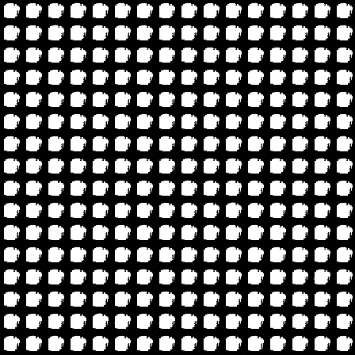

  

  

<b><ins> DCGAN Notes </ins></b>

- In the paper [Unsupervised Representation Learning with Deep Convolutional Generative Adversarial Networks (2016)](https://arxiv.org/pdf/2003.08934.pdf), the authors propose a new class of convolutional neural networks that demonstrate a capability for learning unsupervised representations.

  

---

<ins><b>Introduction</b></ins>

- In tha paper, the authors discuss a way of building good image representations by training a [Generative Adversarial Network (2014)](https://arxiv.org/pdf/1406.2661.pdf) first, and using parts of the generator and discriminator as feature extractors for supervised tasks later.
- The authors also argue that their learning process and the lack of a heurestic cost function are attractive to representation learning.
  

 

- Classical approaches to unsupervised representation learning include the use of clustering, auto-encoders, deep belief networks, etc.
- Generative image models broadly fall into two categories; parametric and non-parametric.
- The non-parametric models are mostly used for image matching, texture synthesis, super-resolution and in-painting.
- Parametric models have been used for texture synthesis and image generation, but the methods often produced noisy results.
- A constant source of criticism of using neural networks is that they are black-box models.
- However, it was shown [(2014)](https://arxiv.org/pdf/1311.2901.pdf) that by using deconvolution operations and filtering the maximal activations, the approximate purpose of each convolutional filter could be found.
- Similarly, it was also shown [(2015)](https://ai.googleblog.com/2015/06/inceptionism-going-deeper-into-neural.html) that using a gradient descent on the inputs shows an ideal image that activates a certain subset of filters.

  

---

 

<ins><b> Approach </b></ins>

- After extensive model exploration, the authors identified a family of architectures that resulted in stable training across a range of datasets and also allowed for training higher resolution and deeper generative models.
- The following modifications were proposed:  
    1. - In the convolutional network, the deterministic spatial pooling function was replacedd with strided convolutions, allowing the newtwork to learn its own spatial downsampling.
    2. - The fully connected laters on top of the convolutional layers were eliminated completely. 
        - Directly connecting the highest convolutional features to the input and the output increased the model stability, without hurting the convergence speed. 
    3. - Batch Normalization, which stabilizes learning by normalizing the input to each unit to have zero mean and unit variance, helps with problems that arise due to poor initiaization and also helps gradient flow in very deep networks. 
        - This method proved to be critical in preventing the generator from collapsing to a single point. 
        - Applying batchnorm to all layers resulted in sample osscillation and model instability, so it was not applied to the generator output and discriminator input.
    4. - The [ReLU function (2010)](https://www.cs.toronto.edu/~fritz/absps/reluICML.pdf) is used in the generator, but the output layer uses the Tanh function.
       - It was observed that a bounded activation function (relu is not bounded as its upper limit is the maximum of the input, while tanh is bounded to [-1, 1]) allowed the model to learn quickly.
       - The [Leaky ReLU (2013)](http://robotics.stanford.edu/~amaas/papers/relu_hybrid_icml2013_final.pdf) activation function was used in the discriminator for higher resolution modeling.

  

<ins> In a nutshell </ins> :

- Replace pooling layers with strided convolutions in the discriminator and fractional-strided convolutions in the generator.
- Remove fully connected hidden layers for deeper architectures.
- Use BatchNorm in both the generator and the discriminator.
- Use ReLU in the generator for all layers except the output, which uses Tanh.
- Use Leaky ReLU in the discriminator for all the layers.

  

---

<ins> References </ins>

[Szeliski, R. (2022), 'Computer vision algorithms and applications' , Springer , London; New York](https://szeliski.org/Book/)  
[Adrian Rosebrock, PyImageSearch](https://pyimagesearch.com)