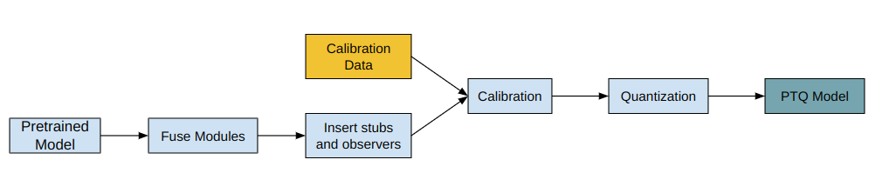
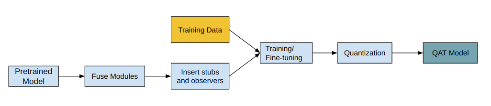

<b><ins> Model Quantization </ins></b>

- Though quantization has roots in information compression, in deep neural networks it refers to reducing the numerical precision of the weights and/or activations.

 

---

 

<b> Mapping function </b>

- The mapping function maps values from floating point space to integer space.
- A commonly used mapping function for input $r$ and quantization parameters $S$ (scaling-factor) and $Z$ (zero-point) is given by:

$$
Q(r) = round(\frac{r}{S} + Z)
$$

- The inverse of this function is used to map values from integer space to floating space.

$$
\tilde{r} = (Q(r) - Z) * S
$$

  

<b> Quantization parameters </b>

- As we know, the mapping function is parameterized by the scale-factor $S$ and zero-point $Z$.
- The scaling-factor $S$ is the ratio of the input range to the output range given by:

$$
S = \frac{\beta - \alpha}{\beta_{q} - \alpha_{q}}
$$

where $[\alpha, \beta]$ are the clipping range of the input, i.e. the boundaries of the permissible inputs, and $[\alpha_{q}, \beta_{q}]$ are the range of the quantized output.

 

- For 8-bit quantization, the output range is $(\beta_{q} - \alpha_{q} <= (2^{8} - 1))$

 

<b> Calibration </b>

- The process of choosing the input clipping is known as calibration.
- This is done by recording the running minimum and maximum values and assigning them to $\alpha$ and $\beta$.
- Oher calibration techniques include entropy maximization (KL divergence), mean-squared-error minimization of the input range.

 

---

 

<b><ins> Post-Training Dynamic Quantization / Weight-Only Quantization </ins></b>

- Here, the weights are pre-quantized, i.e., the activations are quantized on-the-fly (dynamic) during inference.

|Advantages | Disadvantages |
|--- | --- |
| Can result in higher accuracies since clipping is calibrated for each input. | Calibrating and quantizing at the activations at each layer during runtime can add to the compute overhead. |
| Dynamic quantization is preferred for LSTM's and Transformers where writing/retrieving the model weights from memory dominate bandwidths. |
| | |

 

---

 

<b><ins> Post-Training Static Quantization (PTQ) </ins></b>

- PTQ also pre-quantizes the model weights, but instead of calibrating activations on-the-fly, the clipping range is pre-calibrated and fixed ("static") using validation data.
- The activations stay in quantized precision between operations during inference.
- About 100 mini-batches of representative data are sufficient to calibrate the observers.

 

| Advantage | Disadvantage |
| --- | --- |
| Has faster inference than dynamic quantization because it eliminates float $\leftarrow\rightarrow$ int costs between layers. | These models may need regular re-calibration to stay robust against distribution-drift. |
| | |

 

 

---

 

<b><ins> Quantization Aware Training (QAT) </ins></b>

- QAT is great for large models, but the accuracy suffers in smaller models.
- This is due to the loss in numerical precision when adapting a model from FP32 to INT8.
- This problem is tackled by including the quantization error in the training loss, thus training an INT8-first model.

 

- All weights and biases are stored in FP32, and backpropagation takes place as usual.
- However, in the forward pass, the data are quantized and immediately dequantized, adding quantization noise similar to what might be encountered during quantized inference.
- Thus, the final loss accounts for any unexpected quantization errors.

 

| Advantage | Disadvantage |
| --- | --- |
| QAT tields higher accuracy than PTQ. | Computational cost of retraining a model can be high |
| Quantized parameters can be learned during model training for more fine-grained accuracy. | |
|  |  |

 

 

---

 

<b><ins> Sensitivity Analysis </ins></b>

- Since some layers respond to quantization more than others, it is necessary to do a one-at-a-time sensitivity analysis to identify the sensitivity of the layers.
- The precision (FP32) is retained on the layers that minimize the accuracy drop.
- Another approach is to compare the statistics of the FP32 and INT8 layers, usually using metrics like SQNR (Signal to Quantized Noise Ratio) and Mean-Squared-Error.

 

---

 

References:

 

1. https://pytorch.org/docs/stable/quantization.html
2. [A Survey of Quantization Methods for Efficient Neural Network Inference](https://arxiv.org/pdf/2103.13630.pdf)
3. https://pytorch.org/blog/quantization-in-practice/
4. https://leimao.github.io/blog/PyTorch-Static-Quantization/